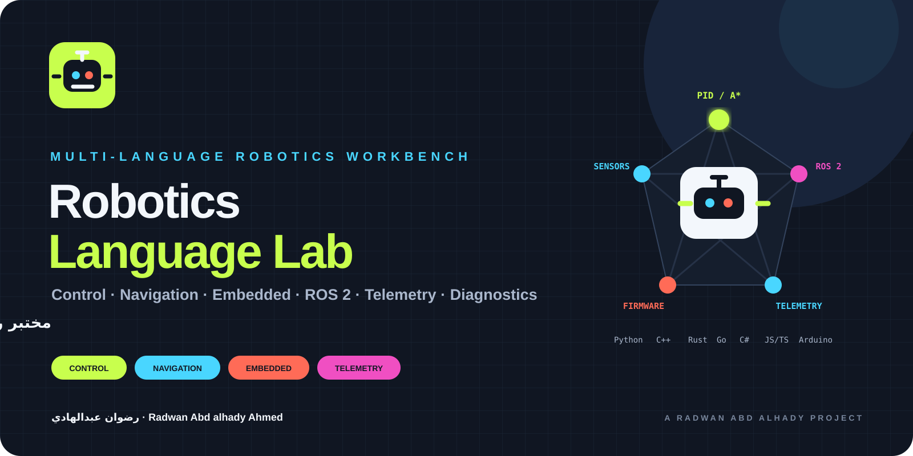
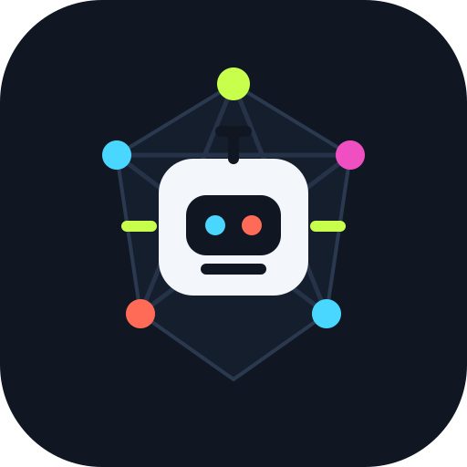

<div align="center">



<br/>



# Robotics Language Lab

**A multi-language robotics workbench for control, navigation, embedded systems, robot description, telemetry, diagnostics, and developer tooling.**

<div dir="rtl">
<strong>مختبر روبوتات عملي متعدد اللغات يربط الحساسات والتحكم والملاحة والأنظمة المضمنة وROS 2 والقياس عن بُعد.</strong>
</div>

<br/>

[](https://github.com/rad03i2/robotics-language-lab/actions/workflows/ci.yml)


**[العربية](README_AR.md) · [English](README_EN.md) · [Architecture](docs/ARCHITECTURE.md) · [Roadmap](docs/ROADMAP.md) · [Safety](SECURITY.md)**

</div>

---

## One lab, many robotics layers

Robotics Language Lab is intentionally a collection of small, inspectable programs rather than a pretend monolithic robot stack. Each folder demonstrates where a language or runtime can fit in a robotics workflow.

<table>
<tr>
<td width="25%"><strong>Sense</strong><br/><sub>IMU filtering, ultrasonic input, ring buffers and hardware-facing examples.</sub></td>
<td width="25%"><strong>Think</strong><br/><sub>PID control, A* planning, occupancy grids and path utilities.</sub></td>
<td width="25%"><strong>Describe</strong><br/><sub>ROS 2-style configuration, launch structure and a small URDF robot model.</sub></td>
<td width="25%"><strong>Observe</strong><br/><sub>Telemetry examples, diagnostics and a browser dashboard.</sub></td>
</tr>
</table>

> This repository is educational. It is not a safety-certified robot-control platform and should not be used as the sole controller for safety-critical machinery.

## Explore the lab

| Area | Examples | Role |
|---|---|---|
| Control | `python/control/`, `cpp/control/` | PID and control-loop concepts |
| Navigation | `python/navigation/`, `cpp/navigation/`, `java/planner/` | A*, occupancy grids and simple planning |
| Sensors | `python/sensors/`, `micropython/` | IMU filtering and ultrasonic sensing |
| Firmware | `arduino/`, `c/` | Line following and embedded data structures |
| Robot model | `ros2/urdf/` | Small differential-drive robot description |
| ROS-style config | `ros2/config/`, `ros2/launch/` | Parameters and launch structure |
| Kinematics | `rust/kinematics/` | Differential-drive wheel velocity example |
| Telemetry | `go/telemetry-server/`, `typescript/telemetry/` | Simulated robot state formats and transport examples |
| Dashboard | `javascript/dashboard/` | Standalone browser telemetry simulation |
| Diagnostics | `csharp/RobotDiagnostics/` | Robot health CLI example |
| Tooling | `docker/`, `shell/` | Development container and helper script |
| Numeric work | `matlab/` | Path smoothing example |

## Start in 30 seconds

Clone once, then run only the toolchain you want to explore:

```bash
git clone https://github.com/rad03i2/robotics-language-lab.git
cd robotics-language-lab
```

### Python control

```bash
python python/control/pid_controller.py
```

### A* navigation

```bash
python python/navigation/a_star.py
```

### Go telemetry endpoint

```bash
go run go/telemetry-server/main.go
```

The Go example exposes simulated JSON telemetry at `http://localhost:8080/telemetry`.

### Browser telemetry demo

Open:

```text
javascript/dashboard/index.html
```

The current browser dashboard is a **standalone simulated telemetry demo**; it generates its own sample state in JavaScript and does not currently consume the Go endpoint.

### C# diagnostics

```bash
dotnet run --project csharp/RobotDiagnostics
```

## A robotics data-flow view

```text
Sensors / Firmware
      │
      ▼
Filtering / State
      │
      ├──────────────► Telemetry / Diagnostics
      ▼
Control
      │
      ▼
Navigation / Motion decisions
      │
      ▼
Robot model + hardware assumptions
```

The repository keeps these layers deliberately separate so that each example remains small enough to inspect.

## Toolchains

There is no repository-wide dependency installer. Use only the toolchain needed for the example you choose.

Recommended baseline for the most directly runnable examples:

- Python 3.10+
- GCC/G++ with C++17 support
- .NET 8 SDK
- Go 1.22+
- a modern browser

Arduino tooling, MicroPython, Rust, Java, MATLAB/Octave, ROS 2 and TypeScript tooling are optional for their respective folders.

## Testing and CI

Run the Python behavioral suite:

```bash
python -m unittest discover -s tests -v
```

GitHub Actions currently verifies:

- Python syntax and behavioral tests on Python 3.10, 3.12 and 3.13 across Ubuntu, Windows and macOS;
- compilation of the checked C and C++ examples;
- a .NET 8 build of the C# diagnostics example.

CI does not emulate physical Arduino/MicroPython hardware or claim full ROS 2 integration testing.

## Hardware safety

Before adapting any example to physical hardware:

- verify voltage levels and board pin mappings;
- validate current and actuator limits;
- isolate or disable motors during early tests;
- add emergency-stop behavior appropriate to the hardware;
- review timing assumptions and mechanical clearances;
- never copy demo gains or pin assignments blindly.

See [SECURITY.md](SECURITY.md) for the full safety guidance.

## Current boundaries

- The ROS 2 folder demonstrates package/configuration structure; it is not a complete production robot stack.
- The dashboard is a lightweight local demo with no authentication, persistence, or fleet management.
- The Go endpoint is a development example, not a hardened internet-facing service.
- Physical sensors, motors and timing cannot be validated by repository CI.
- Examples are deliberately small and may require adaptation before integration into a real robot.

## Repository map

```text
robotics-language-lab/
├── assets/              visual identity
├── arduino/             line-following firmware example
├── c/                   embedded ring buffer
├── cpp/                 control + occupancy grid
├── csharp/              diagnostics CLI
├── docker/              development container
├── docs/                architecture, brand and roadmap
├── go/                  telemetry HTTP example
├── java/                planner example
├── javascript/          standalone browser dashboard
├── matlab/              path smoothing
├── micropython/         ultrasonic sensor example
├── python/              control, navigation and sensors
├── ros2/                config, launch and URDF examples
├── rust/                differential-drive kinematics
├── shell/               helper script
├── tests/               Python behavioral tests
└── typescript/          typed telemetry example
```

## Project documents

| Resource | Purpose |
|---|---|
| [README_AR.md](README_AR.md) | الدليل العربي |
| [README_EN.md](README_EN.md) | Full English guide |
| [docs/ARCHITECTURE.md](docs/ARCHITECTURE.md) | Robotics layers and data flow |
| [docs/BRAND.md](docs/BRAND.md) | Signal Matrix visual identity |
| [docs/ROADMAP.md](docs/ROADMAP.md) | Optional future directions |
| [SECURITY.md](SECURITY.md) | Robotics and network safety |
| [SUPPORT.md](SUPPORT.md) | Troubleshooting and support |
| [CONTRIBUTING.md](CONTRIBUTING.md) | Contribution rules |
| [CHANGELOG.md](CHANGELOG.md) | Notable repository changes |
| [LICENSE](LICENSE) | MIT License |

---

<div align="center">

### Built by رضوان عبدالهادي

**Radwan Abd alhady Ahmed · [@rad03i2](https://github.com/rad03i2)**

<sub>Small examples. Clear assumptions. Real robotics concepts.</sub>

</div>
